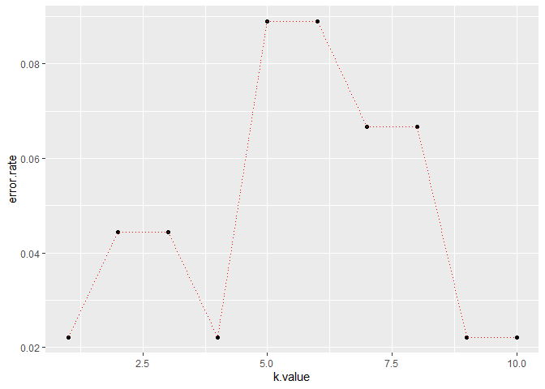

KNN Classifier for IRIS
================
Author: Holiday Tang  
[LinkeDin](https://www.linkedin.com/in/holiday-t/) |
[GitHub](https://github.com/holiday007) | [Kaggle
Novice](https://www.kaggle.com/holibae007)
| Date: 2019-12-29

  - [Get Data](#get-data)
  - [Standardize Variables](#standardize-variables)
  - [Train/Test Split](#traintest-split)
  - [Building KNN model](#building-knn-model)
  - [Misclassification Rate](#misclassification-rate)
  - [Choosing a k value](#choosing-a-k-value)

##### Get Data

``` r
# get & see data
library(ISLR)
head(iris)
```

``` 
  Sepal.Length Sepal.Width Petal.Length Petal.Width Species
1          5.1         3.5          1.4         0.2  setosa
2          4.9         3.0          1.4         0.2  setosa
3          4.7         3.2          1.3         0.2  setosa
4          4.6         3.1          1.5         0.2  setosa
5          5.0         3.6          1.4         0.2  setosa
6          5.4         3.9          1.7         0.4  setosa
```

``` r
# structure of data
str(iris)
```

    'data.frame':   150 obs. of  5 variables:
     $ Sepal.Length: num  5.1 4.9 4.7 4.6 5 5.4 4.6 5 4.4 4.9 ...
     $ Sepal.Width : num  3.5 3 3.2 3.1 3.6 3.9 3.4 3.4 2.9 3.1 ...
     $ Petal.Length: num  1.4 1.4 1.3 1.5 1.4 1.7 1.4 1.5 1.4 1.5 ...
     $ Petal.Width : num  0.2 0.2 0.2 0.2 0.2 0.4 0.3 0.2 0.2 0.1 ...
     $ Species     : Factor w/ 3 levels "setosa","versicolor",..: 1 1 1 1 1 1 1 1 1 1 ...

``` r
# summary of data
summary(iris)
```

``` 
  Sepal.Length    Sepal.Width     Petal.Length    Petal.Width   
 Min.   :4.300   Min.   :2.000   Min.   :1.000   Min.   :0.100  
 1st Qu.:5.100   1st Qu.:2.800   1st Qu.:1.600   1st Qu.:0.300  
 Median :5.800   Median :3.000   Median :4.350   Median :1.300  
 Mean   :5.843   Mean   :3.057   Mean   :3.758   Mean   :1.199  
 3rd Qu.:6.400   3rd Qu.:3.300   3rd Qu.:5.100   3rd Qu.:1.800  
 Max.   :7.900   Max.   :4.400   Max.   :6.900   Max.   :2.500  
       Species  
 setosa    :50  
 versicolor:50  
 virginica :50  
                
                
                
```

##### Standardize Variables

``` r
# standardize data
standardized.iris = data.frame(scale(iris[,-5]))
var(standardized.iris[,1])
```

    [1] 1

``` r
standardized.iris$Species = iris$Species
head(standardized.iris)
```

``` 
  Sepal.Length Sepal.Width Petal.Length Petal.Width Species
1   -0.8976739  1.01560199    -1.335752   -1.311052  setosa
2   -1.1392005 -0.13153881    -1.335752   -1.311052  setosa
3   -1.3807271  0.32731751    -1.392399   -1.311052  setosa
4   -1.5014904  0.09788935    -1.279104   -1.311052  setosa
5   -1.0184372  1.24503015    -1.335752   -1.311052  setosa
6   -0.5353840  1.93331463    -1.165809   -1.048667  setosa
```

##### Train/Test Split

``` r
# train/test split

library(caTools)
Split = sample.split(standardized.iris$Species, SplitRatio = 0.7)

train.data = subset(standardized.iris, Split == T)
test.data = subset(standardized.iris, Split == F)
```

##### Building KNN model

``` r
library(class)

predicted.species = knn(train.data[,1:4], test.data[,1:4], 
                        train.data[,5], k = 1)

# prediction
predicted.species
```

``` 
 [1] setosa     setosa     setosa     setosa     setosa     setosa    
 [7] setosa     setosa     setosa     setosa     setosa     setosa    
[13] setosa     setosa     setosa     versicolor versicolor versicolor
[19] versicolor versicolor versicolor versicolor virginica  versicolor
[25] versicolor versicolor versicolor versicolor versicolor versicolor
[31] virginica  virginica  virginica  virginica  virginica  virginica 
[37] virginica  virginica  virginica  virginica  virginica  virginica 
[43] virginica  virginica  virginica 
Levels: setosa versicolor virginica
```

##### Misclassification Rate

``` r
mean(predicted.species != test.data$Species)
```

    [1] 0.02222222

##### Choosing a k value

``` r
predicted.species = NULL
error.rate = NULL

for (i in 1:10){
  predicted.species = knn(train.data[,1:4], test.data[,1:4], 
                        train.data[,5], k = i)
  error.rate[i] = mean(predicted.species != test.data$Species)
}

error.rate
```

``` 
 [1] 0.02222222 0.04444444 0.04444444 0.02222222 0.08888889 0.08888889
 [7] 0.06666667 0.06666667 0.02222222 0.02222222
```

``` r
k.value = 1:10
error.rate.df = data.frame(error.rate, k.value)

library(ggplot2)

ggplot(error.rate.df, aes(x=k.value, y=error.rate)) + 
  geom_point() + 
  geom_line(lty = "dotted", color = "red")
```

<!-- -->
